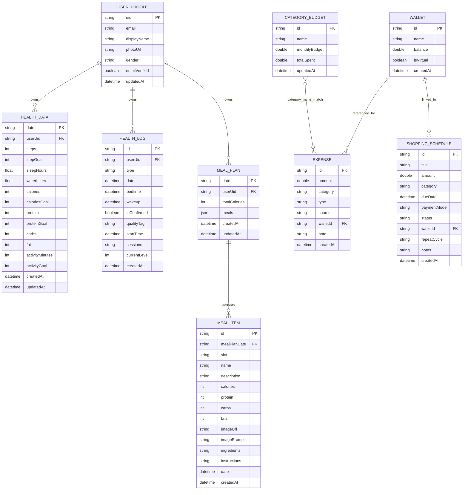

# Family Assistant ERD

This ERD is derived from the current repository implementation and reflects the **actual Firestore-oriented data model** used by the project.

Notes:
- `users`, `wallets`, `expenses`, `shopping_schedules`, and `category_budgets` are stored as top-level collections/documents.
- `health_data`, `health_logs`, and `meal_plans` are stored as **subcollections under `users/{uid}`**.
- `meal_items` are **embedded objects inside a `meal_plans` document**, not a standalone Firestore collection.
- `health_logs` stores **two document shapes in the same subcollection**: `sleep` and `hydration`.
- `shopping_schedules` can create `expenses` in app logic, but there is **no persisted `scheduleId` foreign key** in `expenses`.
- `CATEGORY_BUDGET` and `EXPENSE` are currently linked **logically by category name**, not by a database foreign key.
- `wallets`, `expenses`, `shopping_schedules`, and `category_budgets` currently do **not** store `userUid`, so ownership is not enforced at the data layer.

## Mermaid ER Diagram

## Firestore Mapping

| Logical Entity | Physical Storage in Project |
|---|---|
| `USER_PROFILE` | `users/{uid}` plus Firebase Auth profile fields |
| `HEALTH_DATA` | `users/{uid}/health_data/{yyyy-MM-dd}` |
| `HEALTH_LOG` | `users/{uid}/health_logs/{logId}` |
| `MEAL_PLAN` | `users/{uid}/meal_plans/{yyyy-MM-dd}` |
| `MEAL_ITEM` | Nested object inside `users/{uid}/meal_plans/{yyyy-MM-dd}.meals.{slot}` |
| `WALLET` | `wallets/{walletId}` |
| `EXPENSE` | `expenses/{expenseId}` |
| `SHOPPING_SCHEDULE` | `shopping_schedules/{scheduleId}` |
| `CATEGORY_BUDGET` | `category_budgets/{categoryBudgetId}` |

## Important Design Observations

1. `USER_PROFILE` is split across **Firebase Authentication** and **Firestore**.
2. `HEALTH_LOG` is a polymorphic collection:
   - Sleep documents use `type = sleep` with `bedtime`, `wakeup`, `isConfirmed`, `qualityTag`.
   - Hydration documents use `type = hydration` with `startTime`, `sessions`, `currentLevel`.
3. `HEALTH_DATA` is the app's **daily aggregate record**, while `HEALTH_LOG` stores more detailed per-feature logs.
4. `MEAL_ITEM` is modeled as an entity in the ERD for clarity, although in implementation it is an embedded map inside `MEAL_PLAN`.
5. Only `breakfast`, `lunch`, and `dinner` are currently persisted in `MEAL_PLAN.meals`, even though the enum also defines `snack`.
6. `SHOPPING_SCHEDULE -> EXPENSE` is a business-flow relationship in code, not a strict foreign-key relationship in Firestore.
7. Top-level financial collections are currently global/shared at the schema level because they do not include `userUid`.
